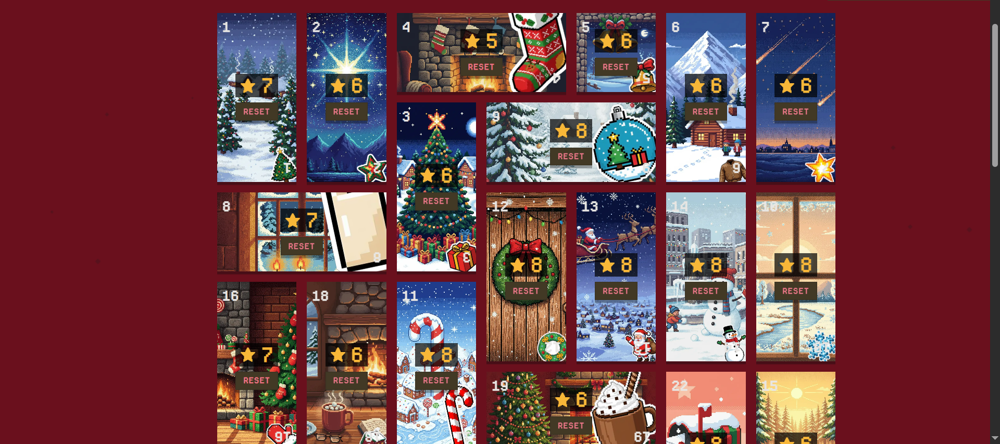

-   [Intro](#intro)
-   [Structure](#structure)
-   [Install](#install)
    -   [Run Individual Tests](#run-individual-tests)
    -   [Run All Tests](#run-all-tests)
-   [Overview](#overview)
    -   [Day 1: Filter gift strings containing '#'](#day-1-filter-gift-strings-containing-)
        -   [The Challenge](#the-challenge)
        -   [My Solution](#my-solution)
        -   [Time complexity](#time-complexity)
        -   [Space complexity](#space-complexity)
    -   [Day 2: Make q total gifts from n object orders](#day-2-make-q-total-gifts-from-n-object-orders)
        -   [The Challenge](#the-challenge-1)
        -   [My Solution](#my-solution-1)
        -   [Time complexity](#time-complexity-1)
        -   [Space complexity](#space-complexity-1)
    -   [Day 3: Draw square gift perimeter](#day-3-draw-square-gift-perimeter)
        -   [The Challenge](#the-challenge-2)
        -   [My Solution](#my-solution-2)
        -   [Time complexity](#time-complexity-2)
        -   [Space complexity](#space-complexity-2)
    -   [Day 4: Decipher pin from cyphered tokens](#day-4-decipher-pin-from-cyphered-tokens)
        -   [The Challenge](#the-challenge-3)
        -   [My Solution](#my-solution-3)
        -   [Time complexity](#time-complexity-3)
        -   [Space complexity](#space-complexity-3)
    -   [Day 5: Countdown](#day-5-countdown)
        -   [The Challenge](#the-challenge-4)
        -   [My Solution](#my-solution-4)
        -   [Time complexity](#time-complexity-4)
        -   [Space complexity](#space-complexity-4)
    -   [Day 6: Matching gloves](#day-6-matching-gloves)
        -   [The Challenge](#the-challenge-5)
        -   [My Solution](#my-solution-5)
        -   [Time complexity](#time-complexity-5)
        -   [Space complexity](#space-complexity-5)
    -   [Day 7: Draw a custom tree](#day-7-draw-a-custom-tree)
        -   [The Challenge](#the-challenge-6)
        -   [My Solution](#my-solution-6)
        -   [Time complexity](#time-complexity-6)
        -   [Space complexity](#space-complexity-6)
    -   [Day 8: Find first non-repeating letter](#day-8-find-first-non-repeating-letter)
        -   [The Challenge](#the-challenge-7)
        -   [My Solution](#my-solution-7)
        -   [Time Complexity](#time-complexity-7)
        -   [Space Complexity](#space-complexity-7)
        -   [Improvements](#improvements)
    -   [Day 9: Move robot](#day-9-move-robot)
    -   [Day 13: Assembly board](#day-13-assembly-board)
        -   [Challenge](#challenge)
            -   [Input example](#input-example)
        -   [Solution](#solution)
            -   [Code](#code)
        -   [Time complexity](#time-complexity-8)
        -   [Space complexity](#space-complexity-8)
            -   [Example, classic loop](#example-classic-loop)
        -   [Tests](#tests)
            -   [Note](#note)




# Intro

I solved [AdventJS 2025 coding challenge](https://adventjs.dev/challenges/2025) using `TypeScript` and `Node.js` for both runtime and tests.

# Structure

Each `day-XX-...` directory contains both:

-   `solution.ts`
-   `solution.test.ts`

The tests are the biggest benefit you can take from this repo (apart from technical discussion) because they contain some of the 'official' input cases which I used them to validate my solution before submitting, and in case the online runner found edge cases my solution didn't handle, I added those case to the test suite and fixed the solution.

# Install

You will need:

-   [Git](https://git-scm.com/install/)
-   [Node.js](https://nodejs.org/en/download/current)
-   [pnpm (though I suppose npm could work too)](https://pnpm.io/installation)

```bash
git clone https://github.com/new-AF/AdventJS-2025-challenge-solutions

cd AdventJS-2025-challenge-solutions

pnpm install
```

## Run Individual Tests

```bash
# pnpm day-xx-folder-...

pnpm day-8-non-repeating-letter
```

## Run All Tests

```bash
pnpm test
```

# Overview

| Day                                            | Difficulty | Solved | Time Complexity | Space Complexity |
| ---------------------------------------------- | ---------- | ------ | --------------- | ---------------- |
| Day 1: Filter gift strings containing '#'      | Easy       | ✅     | O(L)            | O(n)             |
| Day 2: Make q total gifts from n object orders | Easy       | ✅     | O(n + q)        | O(n + q)         |
| Day 3: Draw square gift perimeter              | Easy       | ✅     | O(n^2)          | O(n^2)           |
| Day 4: Decipher pin from cyphered tokens       | Medium     | ✅     | O(L)            | O(L)             |
| Day 5: Countdown                               | Easy       | ✅     | O(L)            | O(1)             |
| Day 6: Matching gloves                         | Easy       | ✅     | O(n)            | O(k)             |
| Day 7: Draw a custom tree                      | Medium     | ✅     | O(h^2)          | O(h^2)           |
| Day 8: Find first non-repeating letter         | Easy       | ✅     | O(n)            | O(n)             |
| Day 9: Move robot                              | Hard       | ✅     | O(m\*n + k)     | O(m\*n)          |
| Day 10: Depth                                  | Easy       | ✅     |                 |                  |
| Day 11: Unwatched gifts                        | Easy       | ✅     |                 |                  |
| Day 12: Elf battle                             | Medium     | ✅     |                 |                  |
| Day 13 Assembly board                          | Medium     | ✅     |                 |                  |
| Day 14: Gift path                              | Easy       | ✅     |                 |                  |
| Day 15: Draw table                             | Medium     | ✅     |                 |                  |
| Day 16 Packing gifts                           | Easy       | ✅     |                 |                  |
| Day 17: Consecutive lights                     | Easy       | ✅     |                 |                  |
| Day 18: Consecutive lights ii                  | Medium     | ✅     |                 |                  |
| Day 19:                                        | Easy       |        |                 |                  |
| Day 20: Vertical warehouse                     | Easy       | ✅     |                 |                  |
| Day 21: Cleaning robot                         | Medium     | ✅     |                 |                  |
| Day 22: Maze                                   | Hard       | ✅     | O(n)            | O(n)             |
|                                                |            |        |                 |                  |

> Space complexity means Auxiliary space, i.e. space reserved for the algorithm itself including the output, but _without_ the input space itself.

## Day 1: Filter gift strings containing '#'

### The Challenge

Return a filtered out array of strings that don't contain character `'#'`

```ts
{
    input: ["car", "doll#arm", "ball", "#train"],
    expectedOutput: ["car", "ball"],
}
```

### My Solution

Pretty straightforward:

-   we'll use `.filter` array method
-   provide a predicate function that will run on each string,
-   use the built-in `.includes` method to ensure the string does not contain `'#'`

### Time complexity

_O(L)_ where _L_ is the total length of all strings provided. This is because in the worst-case we have to process _every_ character of _each_ string before concluding it does not contain the offending character.

In other words the work is proportional to the total length, if the total character count _doubled_, or _tripled_, so would _at least_ the amount of work done.

### Space complexity

_O(n)_ because in the worst case, if no string contains the offending character, we're returning a entire new copy of the array.

## Day 2: Make q total gifts from n object orders

### The Challenge

Given an array of instruction objects, produce `quantity` copies for each string in `toy` value, and return the flattened array. Ignore objects with `quantity` <= 0

```ts
{
    input: [
        { toy: "car", quantity: 3 },
        { toy: "doll", quantity: 1 },
        { toy: "ball", quantity: 2 },
    ],

    expectedOutput: ["car", "car", "car", "doll", "ball", "ball"],
}
```

### My Solution

Pretty straightforward too:

-   we'll `.filter` out objects with `quantity <= 0`
-   `.map` over each object, allocate a new nested array of length `quantity`
    -   `.fill` it with `toy` value strings
-   call `.flat` on the outer array
-   return the flatten array.

### Time complexity

_O(n + q)_ where _q_ is the sum of all quantities, and _n_ the count of all objects. This is broken as O(n) for total objects work, in addition to O(q) for all elements produced.

The work is proportional to both the objects count and how many strings to produce.

### Space complexity

_O(n + q)_ This is broken as O(n) for the temporary array holding references to the objects filtered, in addition O(q) for all elements produced.

## Day 3: Draw square gift perimeter

### The Challenge

Given a `size` length of a square, and a `symbol`, draw the square outer perimeter. Print inner cells as empty (space).

```ts
{
    size: 4,
    symbol: "*",
    expectedOutput: `
****
*  *
*  *
****`,
}
```

### My Solution

-   Iterate `size` times,
-   depending on the index, if it's the first or last line:
    -   draw either the top full `symbol` line, or
    -   draw the mostly hollow middle line, with only 2 `symbol` on the outer perimeter.
-   `.join` the lines with `\n` and print the output.

### Time complexity

_O(n^2)_ because on _each_ iteration, we do _O(n)_ work, creating the _n_ length line.

### Space complexity

_O(n^2)_ because we store _n^2_ cell elements of the square output.

## Day 4: Decipher pin from cyphered tokens

### The Challenge

Given a string of tokens (substrings), process them and output the digit for each token.

Each token resembles this format `n_Ops1_Ops2_...` (without the underscores) where

-   `n` is the initial digit to modify
-   `Ops` are instructions like
    -   `+` to increment,
    -   `-` to decrement,
    -   `<` to return digit from previous token.

```ts
{
    input: "[1++][2-][3+][<]",
    expectedOutput: "3144"
}
```

### My Solution

-   tokenize the string (with regular expressions) as `["1++", "2-", "3+", "<"]`
-   keep a global `previousDigit`
-   iterate over each token,
-   apply `decipher(...)` to obtain the digit
-   `.join` the outputs

### Time complexity

_O(L)_ where _L_ is the entire length of the input string, because we have to process each character and apply the deciphering logic.

### Space complexity

_O(L)_ because I store all the tokens, and other intermediate arrays.

The optimal solution (streaming parser) would be:

-   _O(1)_ if the output size is constrained, as in this case to 4 fixed size slots,
-   _O(n)_ if the input is unbounded, where n where _n_ is the tokens count.

## Day 5: Countdown

### The Challenge

Return the seconds difference between two date-time strings. The caveat is the strings are in a non-standard format so need processing.

```ts
const takeoff = "2025*12*25@00|00|00 NP";

{
    input: "2025*12*24@23|59|30 NP",
    takeoff,
    expectedOutput: 30
}
```

### My Solution

-   apply a fixed number of `.replaceAll` operations to convert the strings to standard format
    -   e.g. `2025*12*24@23|59|30 NP` to `2025-12-24T23:59:30Z`
-   obtain `Date()` objects
-   subtract the dates, to obtain the milliseconds.
-   divide the result by 1000 and `Math.floor` it.

### Time complexity

_O(L)_ because `replaceAll` checks _each_ character to convert all the non-standard symbols.

### Space complexity

_O(1)_ because we only need fixed space for the `Date` objects, and calculations.

## Day 6: Matching gloves

### The Challenge

Count the match pairs of glove objects that are identical in both `color` and `hand` direction. Preserve the order, as soon as a new pair is found list it, multiple pairs of the same color are allowed.

```ts
{
    input: [
        { hand: "L", color: "red" },
        { hand: "R", color: "red" },
        { hand: "R", color: "green" },
        { hand: "L", color: "blue" },
        { hand: "L", color: "green" },
    ],
    expectedOutput: ["red", "green"],
}
```

### My Solution

-   use a hash map `Map` as quasi tally
-   `.forEach` over the input array
-   on the fist encounter of `color`, set it as key, and value as `{left: 0, right:0}` initially
-   later increment the left and right piece
-   as soon as either the left or right count is `>=1` we found a new pair, push it, and decrement counts accordingly

### Time complexity

_O(n)_ where _n_ is the number of objects, because we have to process _each_.

### Space complexity

_O(k)_ or _O(n)_ where _k_ is the number of distinct colors, because they are the keys of the hash map. In the worst case _k = n_ because the whole input would be objects of unique colors but only one piece.

## Day 7: Draw a custom tree

### The Challenge

Draw a centered Christmas tree of `height` and with custom `ornament` that repeat every `frequency`

```ts
{
    height: 5,
    ornament: "o",
    frequency: 2,
    expectedOutput: `
    *
   o*o
  *o*o*
 o*o*o*o
*o*o*o*o*
    #
`,
}
```

### My Solution

-   Iterate `height` times
-   generate the `2 * index + 1` inner array `.fill` it with `*`
-   iterate over all cells and mark those that are `% frequency`
-   center the tree by padding it as `Math.floor((maxWidth - array.length) / 2)`

### Time complexity

_O(h^2)_ where _h_ is `height`. This is because the tree has `h^2 + 1` elements, and this comes from math, the sum of the sequence that represents rows lengths `1, 3, 5, ..., 2 * height - 1` is `h^2` In addition to the base element `#`

### Space complexity

_O(h^2)_ because we store at least the entire tree elements count, in addition to intermediary processing arrays.

## Day 8: Find first non-repeating letter


[https://adventjs.dev/challenges/2025/8](https://adventjs.dev/challenges/2025/8)

### The Challenge

Return the first non-repeating letter (regardless of casing) in a string. If all letters are repeated, the function should return an empty string. e.g.

-   `"Gift"` should return `"G"`
-   `"sS"` should return `""`
-   `"reindeeR"` should return `"i"`

Rest of test cases in `day-8-non-repeating-letter/solution.test.ts`

### My Solution

1.  Use a dictionary (JS Object `{}`)
2.  Iterate over the string and mark if the lowercase letter occurred before.

    We have to run the entire length of the string, because the first non-repeating letter could be at the very end (e.g. `"aaaaaaaaaaaab"`)

3.  Do another pass, and break out of the function at the first letter that is marked as having no duplicates by referencing the dictionary.

### Time Complexity

Assuming the dictionary key insertion and retrieval is O(1) then:

> `findUniqueToy` runs in **O(n)** or linear time, because:

-   Dictionary construction is O(n) because we iterate over the entire string, and do n queries and insertions.
-   O(n) for the final pass, doing n dictionary retrievals.

### Space Complexity

Overall space complexity is **O(n)** because:

-   Dictionary size is O(1) or constant time due to fixed size of alphabet.
-   O(n) for extra array allocation `const array = Array.from(toy);`

    > We could get rid of the extra allocation, and bring overall space complexity to O(1) but we would have to use a regular `for` loop instead of the `forEach` array method (because strings in JS don't have a native `forEach`)
    >
    > To me that's an acceptable tradeoff because I gain extra code _readability_: `forEach` explicitly states that we run the _entire_ length of the string, and there's no early exit as would be possible with a traditional `for` loop.

### Improvements

Instead of the ambiguous empty string (`""`) on failure, the function should always return an object:

```ts
{
    success: boolean;
    (optional) value: string;
}
```

This will explicitly tell if the string had any non-repeating letters. If all the letters are repeated `success` would be `false`, and we wouldn't return `value`

## Day 9: Move robot

// TBW

## Day 13: Assembly board


### Challenge

Link: [https://adventjs.dev/challenges/2025/13](https://adventjs.dev/challenges/2025/13)

```ts
type Factory = string[];
type Result = "completed" | "broken" | "loop";

export const runFactory = (factory: Factory): Result => {
    // ...
};
```

#### Input example

```ts
{
    factory: [
        ">v.",
        "^.."
    ],
    expectedOutput: "completed"
}
```

Move a gift using instructions (`string[]`) on a **2D assembly board**, where each `string` is a series of instructions:

-   `'>'` move gift one step right on same row.
-   `'<'` move gift one step left on same row.
-   `'v'` move gift one row down.
-   `'^'` move gift one row up.
-   `'.'` exit pod.

Return these outcomes, early if possible:

-   `'completed'`, if gift hits an exit spot (`.`)
-   `'loop'`, if gift returns to a previously visited position.
-   `'broken'` if gift ends outside of assembly board.

### Solution

[day-13-assembly-board/solution.ts](day-13-assembly-board/solution.ts)

-   Use a single while loop: get current the row, column position of the gift.

-   Detect loops: use a `Set` to check if we visited a previous position (row, column), and return `'loop'` if need be.

-   Call the handler function for that instruction ( `'>'` ), it returns either:

    -   `'completed'` outcome, in which case return early or,
    -   new position.

-   Check if new position is out of board bounds, and return `'broken'`

-   Continue and process next instruction.

#### Code

```ts
/*

Day 13: Assembly board

Move a gift using instructions (`string[]`) on a **2D assembly board**, where each `string` is a series of instructions:

-   `'>'` move gift one step right on same row.
-   `'<'` move gift one step left on same row.
-   `'v'` move gift one row down.
-   `'^'` move gift one row up.
-   `'.'` exit pod.

Return these outcomes, early if possible:

-   `'completed'`, if gift hits an exit spot (`.`)
-   `'loop'`, if gift returns to a previously visited position.
-   `'broken'` if gift ends outside of assembly board.
*/

type Factory = string[];
type Result = "completed" | "broken" | "loop";

export const runFactory = (factory: Factory): Result => {
    type Instruction = ">" | "<" | "^" | "v" | ".";

    // assembly line outcome
    enum Outcome {
        Broken = "broken",
        Completed = "completed",
        Loop = "loop",
    }

    type Position = { row: number; column: number };

    type Transition = { outcome: Outcome } | Position;

    // visited locations key
    const makeKey = ({ row, column }: Position) => `${row}, ${column}`;

    // is next location out of bounds
    const isOutOfBounds = ({ width, height, row, column }) =>
        row < 0 || row >= height || column < 0 || column >= width;

    // returns either next coordinates, or assembly line outcome
    const instructionHandlers: Record<
        Instruction,
        (pos: Position) => Transition
    > = {
        ".": ({ row, column }) => {
            return { outcome: Outcome.Completed };
        },

        ">": ({ row, column }) => {
            // advance column
            return { row, column: column + 1 };
        },

        "<": ({ row, column }) => {
            // move back
            return { row, column: column - 1 };
        },

        v: ({ row, column }) => {
            // move down
            return { row: row + 1, column };
        },
        "^": ({ row, column }) => {
            // move up
            return { row: row - 1, column };
        },
    };

    // assembly line state
    const state: {
        row: number;
        column: number;
        visitedPositions: Set<string>;
    } = {
        row: 0,
        column: 0,
        visitedPositions: new Set(),
    };

    const boardInfo = {
        width: factory.length > 0 ? factory[0].length : 0,
        height: factory.length,
    };

    while (state.row < boardInfo.height) {
        const line = factory[state.row];
        const instruction = line[state.column];

        // current position
        const currentPosition: Position = {
            row: state.row,
            column: state.column,
        };

        // 1) detect loops (if we visited this previously)
        const key = makeKey(currentPosition);
        if (state.visitedPositions.has(key)) {
            return Outcome.Loop;
        }
        state.visitedPositions.add(key);

        // returns either next coordinates, or assembly line outcome
        const result = instructionHandlers[instruction](currentPosition);

        // 2) break early if success
        if ("outcome" in result) {
            return result.outcome;
        }

        // 3) are new coordinates out of bounds
        const nextPosition = result;

        if (
            isOutOfBounds({
                ...nextPosition,
                width: boardInfo.width,
                height: boardInfo.height,
            })
        ) {
            return Outcome.Broken;
        }

        state.row = nextPosition.row;
        state.column = nextPosition.column;
    }

    // if factory is empty
    return Outcome.Broken;
};
```

### Time complexity

Is **linear `O(n)`** with respect to `n = count of instructions`. If instructions doubled so would run time.

### Space complexity

Is also linear **linear `O(n)`** because of the `Set<Position>` we use to detect loops. At most we'd store `n` positions, i.e. row, column of each instruction result.

#### Example, classic loop

We would have store entire input length (4) before we can tell this is a loop.

```ts
{
    // classic loop
    factory: `
>v
^<
`,
    expectedOutput: "loop",
}
```

### Tests

[day-13-assembly-board/solution.test.ts](day-13-assembly-board/solution.test.ts)

#### Note

`runFactory` takes in `string[]`, where each string contains instructions for that specific row, but this format although easy for the algorithm to digest, makes it hard to _visualize_ the 2D board.

So I made tests input a single multi-line string, that gets converted (split) into `string[]` before being fed to `runFactory`.

Example:

```ts
{
    // classic loop
    factory: `
>v
^<
`,
    expectedOutput: "loop",
}
```

Gets converted to below:

```ts
{
    // classic loop
    factory: [
">v",
"^<"
],
    expectedOutput: "loop",
}
```
